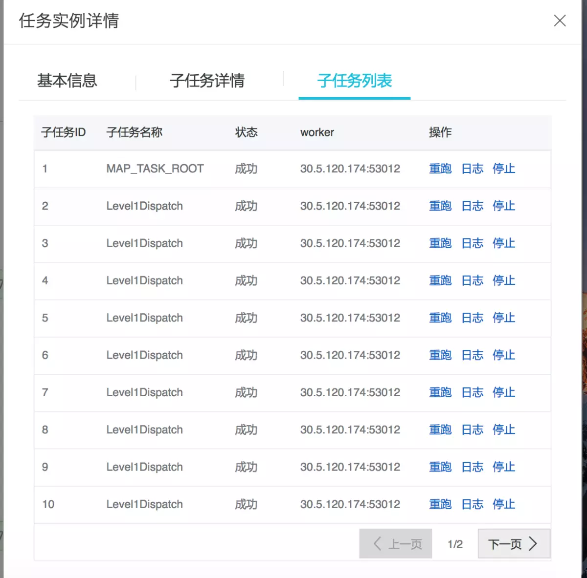
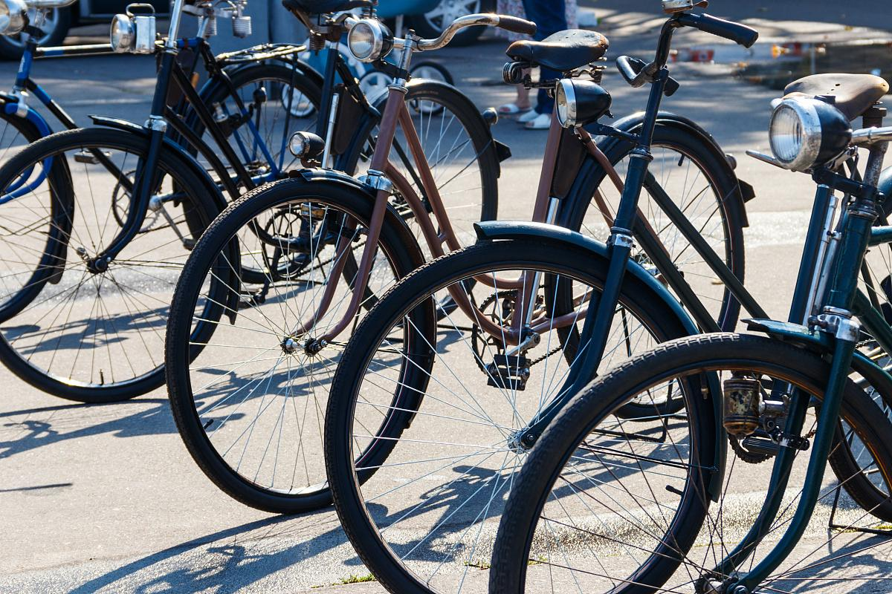
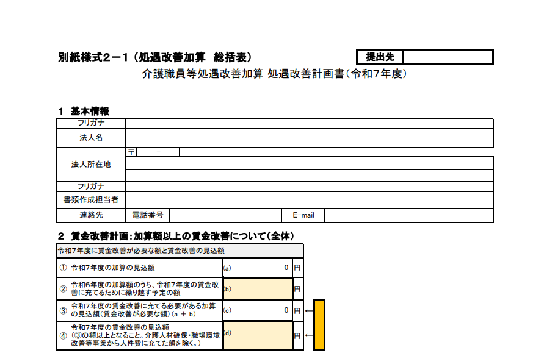

# 摩擦力

- Source: `摩擦力.pptx`
- Total slides: 18

## Slide 1

摩擦力

- 核心问题：摩擦力什么时候产生、方向如何判断、大小怎样计算。
- 学习路径：先看接触和挤压条件，再区分静摩擦、滑动摩擦和滚动摩擦。
- 应用重点：会解释生活中的增大有益摩擦、减小有害摩擦和实验测量方法。

## Slide 2

CONTENTS

目 录

1

2

3

摩擦力的基本概念

摩擦力的计算与应用

摩擦力的实验探究

## Slide 3

01

摩擦力的基本概念

## Slide 4

定义与产生条件

静止在斜面上的木块与斜面相互接触，满足直接接触且挤压的条件，当木块有相对运动趋势时，二者间会产生阻碍相对运动的静摩擦力。

静止在斜面上的木块有沿斜面下滑趋势，此时斜面施加的静摩擦力阻碍其运动趋势；推箱子未动时，箱子与地面间静摩擦力平衡推力，阻止相对运动发生。

木块置于粗糙水平桌面上，施加竖直向下的压力使其紧压桌面，此时接触面既粗糙又存在正压力，满足条件后木块滑动会产生阻碍运动的滑动摩擦力。

## Slide 5

分类及特点

02

03

01

静摩擦力

滑动摩擦力

滚动摩擦力

手握住杯子时，杯子与手之间无相对滑动，此时产生的阻碍相对运动趋势的力即为此类力，属固体间干摩擦，具有方向与相对运动趋势相反等特点。

推箱子时箱子与地面间产生的阻碍相对运动的力即滑动摩擦力，它分静滑动与动滑动，有阻碍相对运动趋势或相对运动的特点，属摩擦力范畴。

汽车轮胎在路面滚动时受的力属此类，它小于滑动摩擦力，分静滚动摩擦和动滚动摩擦，是物体滚动时接触面阻碍相对运动的力。

## Slide 6

方向判断方法

与相对运动趋势相反

人走路时脚向后蹬地，有相对地面向后运动趋势，地面给脚向前的静摩擦力，此力与相对运动趋势相反，其方向可用假设接触面光滑判断。

举例说明不同情况

物体在斜面下滑时，若斜面粗糙，通过比较重力沿斜面分力与最大静摩擦力可判断运动方向；传送带上的箱子，摩擦力方向与相对运动趋势相关，影响其运动状态。

## Slide 7

影响因素分析

> [Image] Image 1

接触面粗糙程度

砂纸表面比玻璃表面更粗糙，与物体接触时，前者因微观凸起更多，增大摩擦系数，在相同压力下能产生更大阻碍相对运动的力，体现接触面状态对摩擦的影响。

正压力大小

物体静止在水平面上，其正压力等于自身重力。若在物体上增加重物，正压力增大，此时接触面粗糙程度不变，摩擦力也随正压力增大而增大。

## Slide 8

02

摩擦力的计算与应用

## Slide 9

计算公式介绍

滑动摩擦力公式

计算物体在水平面上滑动时受的摩擦力，可用公式F=μN，其中μ是动摩擦因数，与接触面材料有关，N是正压力，如木块在木板上滑动，μ取0.3，N为10N，则摩擦力为3N。

静摩擦力取值范围

物体静止在水平面上受拉力作用时，静摩擦力随外力增大从零开始增加，但始终小于等于最大静摩擦力μsN，当外力达μsN时物体开始滑动。

## Slide 10

增大有益摩擦

鞋底花纹增大摩擦

运动鞋底设计成凹凸不平的纹路，通过增加接触面粗糙程度来增大有益作用，使行走或跑步时鞋底与地面间摩擦力显著提升，防止滑倒摔伤。

轮胎花纹的作用

汽车轮胎的纵向沟槽设计能快速排水防滑，在湿滑路面通过增大接触面粗糙程度提升抓地力，这种通过形变增加接触面相互作用的方式有效增强了有益摩擦效应。

## Slide 11

减小有害摩擦

加润滑油减小摩擦

汽车发动机内添加专用润滑油，可形成油膜减少金属部件直接接触，降低运动时产生的阻力。这种措施既控制了阻碍运动的力，又避免零件过度磨损。

用滚动代替滑动

轴承内安装滚珠，将部件间的直接滑动接触转为滚动，显著降低接触面摩擦，减少能量损耗与磨损，这正是通过转变接触方式来减小有害摩擦的实践。

## Slide 12

摩擦力在生活

走路靠摩擦力前进

人行走时脚向后蹬地，地面施加向前的反作用力即静摩擦力，推动身体前进。这种力广泛存在于鞋底与路面、车轮与轨道间，是日常移动和机械运转的基础。

刹车时摩擦力作用

汽车刹车时，刹车片与刹车盘紧密接触，通过相互挤压产生阻碍相对运动的力，使车轮减速，这正是摩擦力在交通出行中的典型应用，保障了行车安全。

## Slide 13

03

摩擦力的实验探究

## Slide 14

实验器材准备

木块、长木板

在探究摩擦力实验中，选用表面平整的长木板作为接触面，将木块置于其上，用弹簧测力计水平拉动，记录不同压力下木块匀速运动时的拉力，分析摩擦力变化。

弹簧测力计、砝码

在探究摩擦力的实验中，需准备弹簧测力计来精确测量拉力大小，砝码用于改变物体对接触面的压力，二者配合可系统分析压力对滑动摩擦力的影响规律。

## Slide 15

实验步骤设计

测量滑动摩擦力

用弹簧测力计水平拉动木块在长木板上匀速滑动，此时测力计示数等于滑动摩擦力大小。实验需控制接触面粗糙程度、压力，多次测量取平均值以提高准确性。

改变条件多次测量

研究物体所受摩擦力时，改变接触面粗糙程度多次测量摩擦力大小，如分别在木板、砂纸、毛巾表面用弹簧测力计水平匀速拉同一木块，记录数据并分析。

## Slide 16

实验数据记录

记录不同条件下的值

在探究物体运动时，可记录不同接触面粗糙程度、正压力下物体所受摩擦力大小。如在光滑木板、粗糙砂纸表面，施加不同压力，测量并记录对应的摩擦力实验数据。

整理成表格形式

将不同材质表面间的摩擦力实验数据整理成表格，包含实验序号、材质组合、正压力、滑动摩擦力数值等，可清晰对比不同条件下的摩擦力变化。

## Slide 17

实验结论得出

分析数据总结规律

在探究物体运动与受力关系时，通过收集不同材质表面物体滑动的距离及速度数据，总结运动变化规律，据此推导实验结论，明确摩擦力对物体运动的关键影响。

验证摩擦力相关知识

通过在水平桌面上用弹簧测力计匀速拉动木块，记录不同接触面粗糙程度下的拉力值，分析数据得出接触面越粗糙摩擦力越大，验证了摩擦力与接触面状况的关系。

## Slide 18

本节小结

- 条件：两个物体直接接触、相互挤压，且接触面存在相对运动或相对运动趋势。
- 判断：摩擦力方向总是阻碍相对运动或相对运动趋势。
- 应用：通过改变粗糙程度、压力或运动方式，可以增大有益摩擦或减小有害摩擦。

