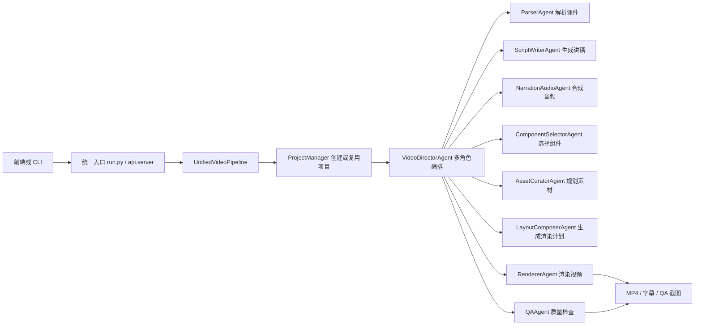

# PPT Master 微课视频生成系统 - 比赛 Demo 提交说明

更新时间：2026-05-13

## 1. 项目定位

本项目面向“课件/教案自动转微课视频”场景，将 PPTX、PDF、DOCX、Markdown 等源文件转换为带讲解音频、字幕、视觉素材和质量检查报告的 MP4 视频。当前版本已经补齐统一命令行入口、后端 API 入口和真实 PPT 样例输出，适合作为比赛 Demo 或答辩演示使用。

## 2. 当前可演示能力

- 一键从源文件创建项目并生成微课视频规划。
- 自动解析 PPT 页面结构，生成逐页讲稿和视频脚本。
- 使用 Edge TTS 或 Windows SAPI 合成旁白音频。
- 根据页面内容选择视频组件，例如时间线、对比布局、团队展示、商业模式等。
- 提取或规划视觉素材，并生成统一渲染计划。
- 使用 ffmpeg 生成 MP4，自动生成并烧录字幕。
- 输出 QA 报告和抽帧截图，用于检查视频、素材、字幕和组件多样性。
- 提供 FastAPI 接口，方便前端上传文件、查看进度、下载结果。

## 3. 系统架构



核心文件：

| 文件 | 作用 |
| --- | --- |
| `run.py` | 统一命令行入口 |
| `pipeline/orchestrator.py` | 统一流水线编排层 |
| `api/server.py` | FastAPI 后端服务 |
| `api/API_CONTRACT.md` | 前端接口契约 |
| `skills/ppt-master/scripts/video_director_agent.py` | 多角色视频生成编排 |
| `skills/ppt-master/scripts/script_plan_to_audio.py` | 逐页 TTS 音频生成 |
| `skills/ppt-master/scripts/ppt_to_video.py` | ffmpeg 视频渲染 |
| `skills/ppt-master/scripts/visual_asset_planner.py` | 视觉素材规划与抽取 |

## 4. 环境准备

本机已验证可用的 Python 环境：

```powershell
C:\Users\魏旭浩\ppt-master\.venv314\Scripts\python.exe
```

依赖安装：

```powershell
cd C:\Users\魏旭浩\ppt-master
& '.\.venv314\Scripts\python.exe' -m pip install -r skills\ppt-master\requirements.txt
```

系统依赖：

- 必需：`ffmpeg`、`ffprobe`
- Edge TTS：需要访问 `speech.platform.bing.com`
- 离线兜底：可切换 `--tts-provider sapi` 使用 Windows 本机语音

检查命令：

```powershell
ffmpeg -version
ffprobe -version
& '.\.venv314\Scripts\python.exe' -c "from api.server import app; print('api ok')"
```

## 5. 命令行 Demo

从真实 PPT 重新跑完整流程：

```powershell
cd C:\Users\魏旭浩\ppt-master
& '.\.venv314\Scripts\python.exe' run.py 'inputs\第8章 创新创业大赛实践.pptx' --execute-assets --render-timeout 1800 --audio-timeout 1200
```

复用已经生成好的项目重新渲染：

```powershell
& '.\.venv314\Scripts\python.exe' run.py --project 'C:\Users\魏旭浩\ppt-master\projects\第8章_创新创业大赛实践_2_ppt169_20260513' --execute-assets --render-timeout 1800 --audio-timeout 1200
```

只生成结构化规划，不渲染视频：

```powershell
& '.\.venv314\Scripts\python.exe' run.py 'inputs\第8章 创新创业大赛实践.pptx' --no-render
```

如果网络 TTS 不可用，使用本机 SAPI：

```powershell
& '.\.venv314\Scripts\python.exe' run.py --project 'C:\Users\魏旭浩\ppt-master\projects\第8章_创新创业大赛实践_2_ppt169_20260513' --tts-provider sapi --execute-assets --render-timeout 1800 --audio-timeout 1200
```

## 6. API Demo

启动后端：

```powershell
cd C:\Users\魏旭浩\ppt-master
& '.\.venv314\Scripts\python.exe' -m uvicorn api.server:app --host 127.0.0.1 --port 8000
```

常用地址：

- 健康检查：`http://127.0.0.1:8000/health`
- Swagger UI：`http://127.0.0.1:8000/docs`
- 阶段表：`http://127.0.0.1:8000/api/stages`

上传文件创建任务：

```powershell
curl.exe --noproxy 127.0.0.1 -X POST http://127.0.0.1:8000/api/jobs `
  -F "file=@inputs\第8章 创新创业大赛实践.pptx" `
  -F "render=true" `
  -F "style=adaptive" `
  -F "execute_assets=true"
```

复用项目创建任务：

```powershell
curl.exe --noproxy 127.0.0.1 -X POST http://127.0.0.1:8000/api/jobs `
  -F "project_path=C:\Users\魏旭浩\ppt-master\projects\第8章_创新创业大赛实践_2_ppt169_20260513" `
  -F "render=true"
```

前端对接细节见：

```text
C:\Users\魏旭浩\ppt-master\api\API_CONTRACT.md
```

## 7. 已验证样例结果

输入文件：

```text
C:\Users\魏旭浩\ppt-master\inputs\第8章 创新创业大赛实践.pptx
```

项目目录：

```text
C:\Users\魏旭浩\ppt-master\projects\第8章_创新创业大赛实践_2_ppt169_20260513
```

最终视频：

```text
C:\Users\魏旭浩\ppt-master\projects\第8章_创新创业大赛实践_2_ppt169_20260513\exports\adaptive_style_final.mp4
```

本次验证数据：

| 指标 | 结果 |
| --- | --- |
| PPT 页数 | 35 |
| 生成音频 | 30 段，5 页为空讲稿跳过 |
| 视频时长 | 约 279 秒 |
| 最终视频大小 | 约 9.39 MB |
| QA 结论 | `overall = pass` |
| 组件类型 | 7 类 |
| 已准备视觉素材页 | 21 页 |

QA 输出：

```text
C:\Users\魏旭浩\ppt-master\projects\第8章_创新创业大赛实践_2_ppt169_20260513\video_qa_report.json
```

抽帧截图：

```text
C:\Users\魏旭浩\ppt-master\projects\第8章_创新创业大赛实践_2_ppt169_20260513\exports\video_agent_qa_frame_01.png
C:\Users\魏旭浩\ppt-master\projects\第8章_创新创业大赛实践_2_ppt169_20260513\exports\video_agent_qa_frame_02.png
C:\Users\魏旭浩\ppt-master\projects\第8章_创新创业大赛实践_2_ppt169_20260513\exports\video_agent_qa_frame_03.png
```

## 8. 适合答辩强调的技术点

1. 统一流水线入口  
   原项目工具链较分散，现在通过 `run.py` 和 `UnifiedVideoPipeline` 将项目创建、源文件导入、视频导演、渲染、QA 串成一个稳定流程。

2. 多角色视频导演架构  
   将视频生成拆为解析、讲稿、音频、组件、素材、布局、渲染、质检多个角色，每个角色产出结构化 JSON，便于调试、复用和前端展示进度。

3. 结构化中间产物  
   `slide_ir.json`、`video_script_plan.json`、`component_plan.json`、`asset_plan.json`、`render_plan.json` 让系统不只是黑盒生成视频，而是每一步都有可解释产物。

4. 前后端分离能力  
   FastAPI 提供任务创建、进度轮询、结果下载接口，前端不需要理解内部脚本，只需要按任务模型展示进度和下载 MP4。

5. 质量检查闭环  
   渲染完成后自动检查最终视频、素材缺失、组件多样性、字幕重复和 QA 抽帧，降低 Demo 临场失败风险。

6. 可降级的音频方案  
   默认使用 Edge TTS，网络受限时可切换 Windows SAPI，保证比赛现场仍有兜底路径。

## 9. 提交材料建议

建议提交或展示以下内容：

| 材料 | 路径或说明 |
| --- | --- |
| 可运行源码 | `C:\Users\魏旭浩\ppt-master` |
| Demo 视频 | `projects\第8章_创新创业大赛实践_2_ppt169_20260513\exports\adaptive_style_final.mp4` |
| API 契约 | `api\API_CONTRACT.md` |
| 本说明文档 | `比赛Demo提交说明.md` |
| QA 报告 | `projects\第8章_创新创业大赛实践_2_ppt169_20260513\video_qa_report.json` |
| QA 截图 | `exports\video_agent_qa_frame_01.png` 至 `03.png` |

## 10. 现场演示顺序

1. 打开最终视频，展示 PPT 自动转微课视频效果。
2. 打开 `video_agent_state.json`，展示多角色流水线和每步产物。
3. 启动 API 服务，打开 Swagger UI。
4. 前端上传 PPT 或复用项目，展示任务进度。
5. 任务完成后下载最终 MP4 和 QA 报告。

